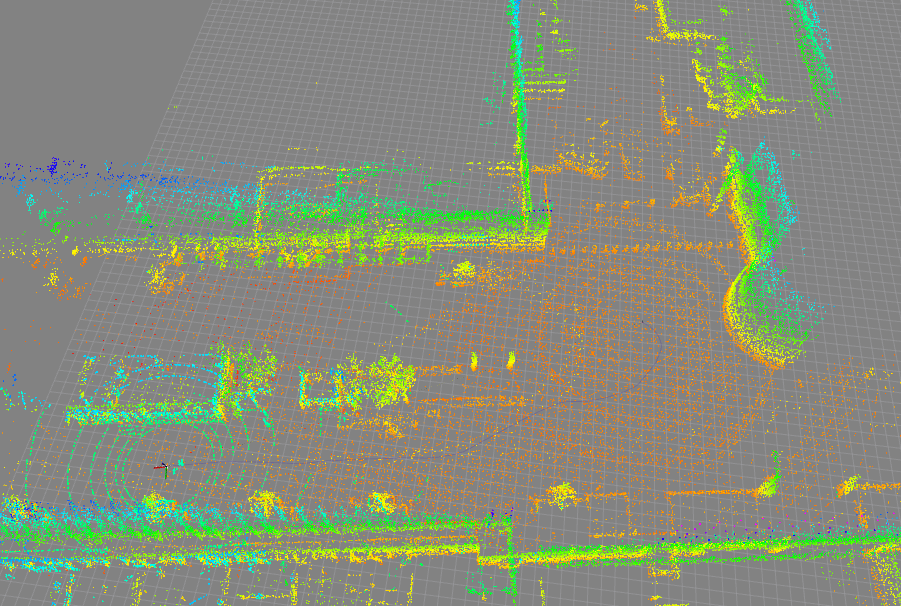
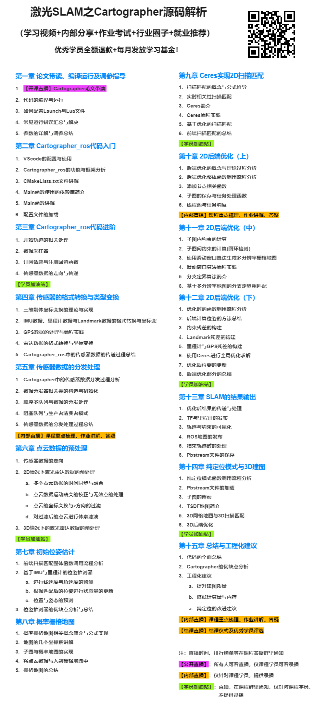

# cartographer 超详细注释代码

## 项目简介
基于2021.04.20日在github上下载的master的代码的注释版本
1. 在代码中进行了规范, 超详细的注释, 帮助大家更好的理解cartographer
  **注释多数在 .cc 文件中, .h文件中存在cartographer原本的注释**
2. 对cartographer中的关键概念进行了解释与说明
3. 对cartographer中使用的**c++11新标准**语法进行了标注与说明
4. 对3d的cartographer添加了实时显示三维点云地图与保存地图的功能

## 实时显示三维点云地图与保存地图的功能简述
显示三维点云地图需要是在建3d轨迹的情况下才可以显示, 点云地图默认发布在 `/point_cloud_map` 话题中.

默认关闭了保存pcd格式点云的功能, 如需要这个功能, 需要将node.cc文件的第1029行的 `constexpr bool save_pcd = false;` 改成true.

编译之后在建图结束后通过调用 `/write_state` 服务, 会在生成pbstream文件的同时也对pcd文件进行保存, 保存目录与pbstream文件同一个文件夹.

个人水平有限, 如果改完的代码有问题请您联系我进行改正.

## 课程简介与购买链接

如果是购买了本项目的对应**课程**的同学, 还会有
- 逐行讲解cartographer代码的学习视频
- 帮助理解代码结构的的思维导图
- 难理解部分的代码通过画图来对原理进行讲解
- 关键部分的公式推导课件

### 课程简介
激光SLAM是机器人、自动驾驶领域的底层核心技术, 招聘规模越来越大, 薪资也一路水涨船高, 应计算机视觉life公众号粉丝要求, 我们经过几个月打磨, 推出了激光SLAM独家逐行源码解析课程《Cartographer从入门到精通: 原理深剖+源码逐行详解》

### 课程大纲

### 课程购买链接
扫描大纲图片上的二维码即可查看课程购买地址, 图片刷不出来也可以通过下面这个链接进行更详细的了解与购买

[购买链接](https://mp.weixin.qq.com/s/5RV3ZWFiFykIBjSllFQcAQ)

## 推荐编译环境
- ubuntu 16.04/18.04 版本
- ROS Kinetic/Melodic 版本
- vscode

vscode中推荐的插件有: 
- C/C++
- C++ Intellisense
- Doxygen Documentation Generator
- Msg Language Support
- XML Tools
- Todo Tree: 注释的高亮显示

## 运行相关命令

### 2d建图指令
`roslaunch cartographer_ros lx_rs16_2d_outdoor.launch`

### 保存2d轨迹,并生成ros格式的地图
`./finish_slam_2d.sh`

### 纯定位模式
`roslaunch cartographer_ros lx_rs16_2d_outdoor_localization.launch`

### 3d建图指令
`roslaunch cartographer_ros lx_rs16_3d.launch`

### 保存3d轨迹
`./finish_slam_3d.sh`

### 使用asset生成ros格式的2d栅格地图
`roslaunch cartographer_ros assets_writer_2d.launch`

### 使用asset生成3d点云地图
`roslaunch cartographer_ros assets_writer_3d.launch`

### landmark使用示例
`roslaunch cartographer_ros landmark_mir_100.launch`

**by lixiang**
